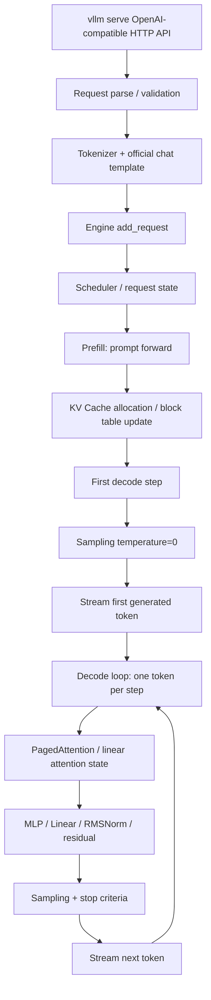

# vLLM/DCU 热点路径图

本文件用于指导后续阅读 vLLM 0.18.1 源码和 DCU profiling。由于本地没有 vLLM 源码和 DCU 环境，以下路径先以 vLLM 0.18.1 文档和公开架构为基础，等进入评测容器后再替换为真实代码行号。

## 1. 请求路径总览

## 2. 指标归因

| 指标 | 计时范围 | 主要相关模块 | 重点瓶颈 |
| --- | --- | --- | --- |
| TTFT | 客户端发出 HTTP 请求到收到首个生成 token | HTTP API、tokenizer、scheduler、prefill、首轮 decode、stream flush | tokenizer 编码、prefill 长上下文计算、首次 KV 分配、Python 调度、kernel launch |
| TPOT | 首 token 到末 token 的时间差 / (`output_tokens - 1`) | decode loop、Attention、Linear/MLP、sampling、streaming | PagedAttention KV 读取、Linear/GEMM 小 batch 效率、kernel launch、显存带宽 |
| Throughput | 完成请求生成 token 总数 / wall time | decode loop 主导 | TPOT、输出长度、尾延迟、完成率 |
| 显存峰值 | 服务运行期间峰值 | 权重、KV Cache、临时 buffer、allocator | KV block 数、碎片、workspace、allocator 行为 |

## 3. vLLM 重点源码区域

进入官方容器或 vLLM 源码后，优先查找以下区域。文件名可能随 0.18.1 具体实现变化，需要以实际源码为准。

| 子系统 | 查找关键词 | 调研目的 |
| --- | --- | --- |
| OpenAI API server | `chat`, `completion`, `stream`, `served_model_name` | 确认接口是否完全走官方路径，标记 TTFT 起点后的服务端开销 |
| Engine entry | `add_request`, `generate`, `AsyncLLMEngine`, `LLMEngine` | 找到请求进入 engine 的路径 |
| Scheduler | `schedule`, `running`, `waiting`, `max_num_seqs`, `max_num_batched_tokens` | 并发 1 下是否仍有通用调度开销；注意不要违规改 batch scheduler 语义 |
| KV cache manager | `KVCache`, `block`, `block_table`, `num_gpu_blocks`, `allocate`, `free` | 分析 block 粒度、回收、碎片和显存预算 |
| Attention backend | `PagedAttention`, `attention_backend`, `kv_cache`, `block_size` | 定位 decode PagedAttention kernel 和 layout |
| Model runner | `prefill`, `decode`, `execute_model`, `model_runner` | 分离 TTFT 和 TPOT 路径 |
| Sampling | `temperature`, `greedy`, `Sampler`, `logits_processor` | temperature=0 下是否存在可削减开销 |
| Worker/executor | `worker`, `executor`, `gpu_worker`, `device_worker` | 查找 Python 调度、同步、拷贝和 kernel launch 路径 |
| Metrics/logging | `TTFT`, `TPOT`, `ITL`, `output_token_throughput` | 对齐官方 bench 和服务端日志 |

## 4. Qwen3.5-27B 对热点的影响

公开 `config.json` 显示该模型不是传统每层 full attention 的 decoder-only 结构，而是 3:1 `linear_attention` / `full_attention` 混合结构：

| 特征 | 对优化的影响 |
| --- | --- |
| 64 层 | Linear/MLP/RMSNorm kernel launch 数量多，单请求 decode 容易受小 kernel 调度影响 |
| 16 层 full attention | 长上下文下传统 KV Cache 线性增长主要来自这些层 |
| 48 层 linear attention | 需要确认 vLLM 对 Gated DeltaNet/linear attention state 的缓存、kernel 和 fallback 情况 |
| 4 KV heads、head_dim 256 | GQA 降低 KV cache 大小，但 decode 仍可能受长上下文 KV 读取带宽影响 |
| bf16 权重 | 默认精度稳定，但低精度临时计算需逐项验证 |
| max_position_embeddings 262144 | 模型支持超过赛题 32k，但评测锁定 `--max-model-len 32768` |

## 5. DCU profiling 关注点

| 关注点 | 工具或来源 | 要回答的问题 |
| --- | --- | --- |
| 设备识别与显存 | `rocm-smi` / 平台工具 | 单卡型号、可用显存、运行频率、温度、功耗是否稳定 |
| kernel 时间线 | rocprof / DTK profiler | decode loop 是否被 PagedAttention、GEMM 或小 kernel launch 主导 |
| HIP API trace | rocprof HIP trace | 是否存在大量同步、内存分配、memcpy |
| HBM 带宽 | profiler counters | 16k-32k TPOT 是否带宽受限 |
| occupancy / wavefront | profiler counters | custom kernel 是否充分利用 DCU 计算资源 |
| allocator 行为 | vLLM 日志 + profiler | 是否有运行期频繁分配或碎片 |
| kernel 编译 | `hipcc --version`、编译日志 | custom kernel 是否使用正确 arch 和优化参数 |

## 6. 预期热点假设

以下是假设，不是性能结论，需要 baseline 数据验证。

| 假设 | 影响指标 | 验证方法 |
| --- | --- | --- |
| 8k-16k 和 16k-32k 的 TPOT 主要受 full attention 层 KV 读取带宽影响 | TPOT P99、Throughput | 三档 TPOT 随上下文长度变化 + profiler 中 Attention kernel 占比 |
| TTFT 主要受 tokenizer + prefill + 首次 KV 分配影响 | TTFT P99 | 对比 tokenizer 耗时、prefill kernel 时间和首步调度日志 |
| 单请求并发 1 下通用 scheduler/worker 路径存在可削减固定开销 | TTFT、TPOT | Python profiler / tracing，检查每 token 调度调用栈 |
| Qwen3.5 linear attention 层可能存在 fallback kernel 或不适配 DCU 的慢路径 | TTFT、TPOT | profiler 识别 linear attention 相关 kernel 与 PyTorch fallback |
| greedy sampling 下 logits 处理仍有不必要通用开销 | TPOT | 采样阶段耗时、CPU/GPU 同步点 |

## 7. 后续源码阅读清单

拿到 vLLM 0.18.1 源码后，按以下顺序阅读：

1. 服务启动参数解析，确认哪些参数被平台锁定。
2. OpenAI API streaming path，标出 first token flush 点。
3. engine `add_request` 到 scheduler 的路径。
4. prefill/decode 分支和 model runner。
5. Qwen3.5 模型适配文件，确认 full/linear attention 的具体实现。
6. KV cache config、block manager 和 block table。
7. attention backend 和 custom op/kernels。
8. sampler/logits processor 在 temperature=0 下的路径。
9. worker/executor 中的同步、拷贝、事件和 profiling hooks。

