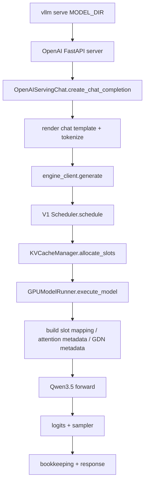

# 启动脚本与 vLLM 源码分析

## 1. 固定启动与测评约束

官方启动脚本 `testdata/start_vllm.sh` 只允许我们通过 vLLM 源码影响行为，不能改脚本本身。核心参数如下：

| 参数 | 固定值 | 对优化的含义 |
|---|---:|---|
| served model | `Qwen3.5-27B` | OpenAI Chat 请求会按该模型名路由。 |
| dtype | `bfloat16` | 权重和主计算默认 BF16，不能做持久化权重量化。 |
| tensor parallel | `1` | 初赛单卡；所有收益来自单卡执行、调度、内存和 kernel。 |
| max-num-seqs | `128` | 并发测评为 1，但内部 batch/cudagraph/persistent buffer 仍按上限建模。 |
| max-num-batched-tokens | `4096` | 长 prompt 必然 chunked prefill；8k-16k 大约 2-4 个 prefill chunk，16k-32k 大约 4-8 个 chunk。 |
| gpu-memory-utilization | `0.95` | KV/mamba cache 空间由源码 profiling 和 cache spec 决定。 |
| default chat kwargs | `{"enable_thinking": false}` | 精度和输出格式依赖该行为，不能破坏。 |
| reasoning/tool parser | `qwen3` / `qwen3_coder` | 请求后处理路径较重，但吞吐脚本非 streaming，主要影响服务端前后处理开销。 |

一个需要确认但很重要的点：启动脚本没有显式传 `--max-model-len 32768`。如果模型配置中的 `max_position_embeddings` 为 262144，vLLM 可能使用更大的 `max_model_len` 做元数据、block table 或图捕获边界；而官方评测输入只覆盖到 32k。源码层面“默认为本比赛模型收敛到 32768”可能有收益，但属于规则边界待确认项：它不改权重/模型结构/tokenizer，但会影响服务参数等效行为。

官方吞吐脚本固定为：

| 参数 | 固定值 |
|---|---:|
| backend | `openai-chat` |
| endpoint | `/v1/chat/completions` |
| max-concurrency | `1` |
| request-rate | `1` |
| temperature | `0` |
| custom-output-len | `1024` |
| num-warmups | `2` |
| percentile metrics | `ttft,tpot,itl,e2el` 的 `50,95,99` |

因此优化目标不是高并发吞吐，而是单请求长 prompt + 1024 decode 的端到端吞吐，并且必须守住 TTFT P99、TPOT P99 和精度。

## 2. Baseline 成绩解读

平台 baseline 提交结果：

| 桶 | 实际吞吐率 |
|---|---:|
| 4k-8k | 12.94 |
| 8k-16k | 10.06 |
| 16k-32k | 5.77 |

按赛题权重估算加权吞吐约为：

```text
0.2 * 12.94 + 0.5 * 10.06 + 0.3 * 5.77 = 9.349
```

平台显示 `SLA扣分=0`、`精度扣分=0`，说明 baseline 已经通过 TTFT/TPOT 和 OpenCompass 精度门槛。第一轮优化应避免改变输出语义或采样行为，优先做执行路径优化。由于 8k-16k 权重 50%、16k-32k 权重 30%，优先级应是：

1. 提升长 prefill 的每 chunk 效率，尤其是 8k-32k。
2. 降低 decode TPOT，输出固定 1024 token，decode 仍占总时间大头。
3. 降低单请求 scheduler/metadata/bookkeeping 的 Python/CPU 开销，收益可能小但风险低。

## 3. 服务请求主路径

源码确认 `vllm.engine.llm_engine` 和 `async_llm_engine` 已经指向 V1 实现，因此比赛服务走 V1 引擎。

主链路：



关键源码位置：

| 路径 | 作用 |
|---|---|
| `vllm/entrypoints/cli/serve.py` | `vllm serve` CLI 入口，单 API server 时直接 `run_server(args)`。 |
| `vllm/entrypoints/openai/api_server.py` | 构建 `AsyncLLM.from_vllm_config`，初始化 OpenAI API server 状态。 |
| `vllm/entrypoints/openai/chat_completion/serving.py` | Chat request 渲染、采样参数转换、调用 `engine_client.generate`。 |
| `vllm/v1/core/sched/scheduler.py` | V1 调度主循环，chunked prefill/decode 都统一按 token budget 调度。 |
| `vllm/v1/core/kv_cache_manager.py` | KV block 分配、prefix hit 查询、block cache/free。 |
| `vllm/v1/worker/gpu_model_runner.py` | 组 batch、构造 attention metadata、执行模型、logits/sampling/bookkeeping。 |

## 4. Qwen3.5 模型路径

本源码有专门的 `Qwen3_5ForConditionalGeneration`，不是普通 Qwen3 fallback。

Qwen3.5 文本层默认按 `full_attention_interval=4` 展开：

```text
linear_attention, linear_attention, linear_attention, full_attention, ...
```

即 64 层时约 48 层 GDN/linear attention + 16 层 full attention。源码中：

| 路径 | 观察 |
|---|---|
| `vllm/transformers_utils/configs/qwen3_5.py` | `layer_types` 默认为 3 个 `linear_attention` 后 1 个 `full_attention`。 |
| `vllm/model_executor/models/qwen3_5.py` | `Qwen3_5DecoderLayer` 根据 layer type 选择 `Qwen3_5GatedDeltaNet` 或 `Qwen3NextAttention`。 |
| `vllm/model_executor/models/qwen3_5.py` | `Qwen3_5GatedDeltaNet.forward` 中先做 fused projection，再调用 `torch.ops.vllm.gdn_attention_core`。 |
| `vllm/model_executor/models/qwen3_next.py` | GDN decode/prefill 的具体状态与 recurrent kernel 逻辑。 |

这意味着瓶颈不能只按传统全 attention 判断。长上下文 prefill 同时包含：

1. 16 层 full attention 的 PagedAttention / chunked prefill。
2. 48 层 GDN 的 projection、causal conv、recurrent state 和 `gdn_attention_core`。
3. 全部 64 层 MLP/GEMM/RMSNorm。

## 5. Scheduler 与 cache 观察

启动脚本固定 `max_num_batched_tokens=4096`，Scheduler 内部用它作为 `max_num_scheduled_tokens` 默认值。V1 scheduler 的注释明确：没有单独的 prefill/decode phase，而是让 `num_computed_tokens` 追上 `num_tokens_with_spec`。因此长 prompt 会被切成多个 step：

| 长度桶 | 粗略 prefill step 数 |
|---|---:|
| 4k-8k | 1-2 |
| 8k-16k | 2-4 |
| 16k-32k | 4-8 |

源码中还有 hybrid/mamba 相关的 block-aligned split：

| 路径 | 观察 |
|---|---|
| `vllm/v1/core/sched/scheduler.py` | `_mamba_block_aligned_split` 会为了 mamba cache align 按 block size 调整 prefill chunk。 |
| `vllm/v1/kv_cache_interface.py` | `MambaSpec.max_memory_usage_bytes` 在 `align` 模式下只保留少量 state page，在 `all` 模式下随 max_model_len 增长。 |
| `vllm/model_executor/models/qwen3_5.py` | Qwen3.5 不支持 `mamba_cache_mode=all`，提示使用 `align`。 |

当前启动脚本未传 `--mamba-cache-mode`，默认是 `none`。这意味着 GDN/Mamba 状态是否能跨 chunk 高效复用，需要从实际日志或 profiling 确认；源码里 Qwen3.5 明确支持 `align` 但不支持 `all`。在不能改启动脚本的前提下，可以研究是否针对 Qwen3.5 在源码默认启用更合适的 `align`，但这必须做精度和 TTFT/TPOT 对照。

## 6. ROCm/DCU attention 路径

ROCm 平台后端选择逻辑：

1. 如果启用 AITER Unified Attention，优先尝试 `ROCM_AITER_UNIFIED_ATTN`。
2. 如果启用 AITER MHA，尝试 `ROCM_AITER_FA`。
3. 如果配置 `use_prefill_decode_attention`，加入 `ROCM_ATTN`。
4. 默认 fallback 到 `TRITON_ATTN`。

源码中 `RocmPlatform.get_attn_backend_cls` 会把 selector 里的 `block_size` 清空后选择后端；而平台默认 block size 没有用户指定时，ROCm 会设为 16，AITER unified attention 时设为 64。

`RocmAttentionBackend` 特点：

| 路径 | 观察 |
|---|---|
| `vllm/v1/attention/backends/rocm_attn.py` | `forward_includes_kv_cache_update=False`，KV cache 写入和 attention forward 分开。 |
| `vllm/model_executor/layers/attention/attention.py` | full attention forward 前会单独调用 `unified_kv_cache_update`，再调用 `unified_attention_with_output`。 |
| `vllm/v1/attention/backends/rocm_attn.py` | attention forward 走 `chunked_prefill_paged_decode`。 |
| `vllm/v1/attention/backends/rocm_attn.py` | block size 16/32 走 HIP C++ `PagedAttention.write_to_paged_cache`，其他 block size 走 Triton cache 写入。 |

对本比赛最值得验证的是：实际平台默认到底落在 `TRITON_ATTN`、`ROCM_ATTN` 还是 AITER 后端。这个可以通过启动日志确认；不同后端对 16 层 full attention 的 decode/prefill 性能差异可能很大。

## 7. 当前最可能瓶颈

结合 baseline 曲线，初步判断如下：

| 瓶颈候选 | 为什么可能重要 | 主要影响 |
|---|---|---|
| 长 prefill 被 4096 token 分 chunk | 16k-32k 吞吐从 10.06 降到 5.77，说明长输入成本显著上升。 | TTFT、端到端吞吐 |
| GDN/linear attention prefill 和状态处理 | Qwen3.5 有 48 层 GDN，`gdn_attention_core` 和状态处理是专属热点。 | TTFT、TPOT |
| full attention decode PagedAttention | 1024 输出 token 固定，每步都要读 16 层 full-attn KV。 | TPOT、吞吐 |
| KV/mamba block 和 metadata 构造 | 并发 1 仍每步构造 slot mapping、attention metadata、bookkeeping。 | TPOT P99、小幅吞吐 |
| max_model_len 过大 | 启动脚本未显式 32768，若使用 262144，可能放大 block table 和图捕获边界。 | TTFT、显存、启动/profiling、可能 TPOT |
| OpenAI chat 后处理 | 非 streaming 下工具/reasoning parser 影响有限，但仍有请求级开销。 | 小幅端到端 |

## 8. 第一轮源码实验建议

P0 候选：

| 方向 | 预期收益 | 风险 | 验证方式 |
|---|---|---|---|
| 确认并优化实际 attention backend 选择 | full attention decode/prefill 直接受益，尤其 8k-32k | 中等，需要看 DCU/AITER 支持 | 启动日志 + 三桶吞吐 + TTFT/TPOT |
| 针对 Qwen3.5 研究 `max_model_len` 默认 32768 | 降低无效元数据/显存/graph 边界，可能改善长桶稳定性 | 规则待确认，不能低于评测最长输入+输出 | 先用源码日志确认当前 max_seq_len，再 A/B 测 |
| profiling GDN prefill/decode 路径 | Qwen3.5 特有热点，可能是最大收益来源 | 中等，kernel/torch op 调优难度高 | torch profiler / rocprof / vLLM internal timing |

P1 候选：

| 方向 | 预期收益 | 风险 | 验证方式 |
|---|---|---|---|
| KV cache update 与 ROPE/cache 融合路径 | full attention 每层都涉及 KV 写入，decode/prefill 都可能受益 | 中等，需严测精度 | 三桶吞吐 + OpenCompass |
| scheduler/metadata 单并发快路径 | 并发 1 固定，可减少 Python/CPU 开销 | 低到中，容易引入边界 bug | TPOT P99、profile CPU trace |
| GDN/mamba cache mode `align` 对照 | 可能减少跨 chunk 的状态重算或搬运 | 中等，必须验证精度和 SLA | 逐桶吞吐、TTFT P99、OpenCompass |

暂不建议第一轮做：

| 方向 | 原因 |
|---|---|
| 持久化权重量化 | 赛题禁止。 |
| 投机解码/MTP/draft model | 赛题禁止，且会改变输出路径。 |
| 修改 tokenizer/chat template/采样参数 | 高风险违规，且精度已无扣分。 |
| 测试集缓存/请求跳过 | 明确禁止。 |
| 大范围改 OpenAI API 行为 | 收益小，容易影响兼容性。 |

## 9. 下一步需要拿到的数据

为了把“猜瓶颈”变成“按数据改源码”，下一步建议在 DCU 平台收集：

1. 启动日志中的 `Using max model len`、attention backend、block size、mamba cache mode、async scheduling 状态。
2. 三个吞吐桶的 `result.json`：总时长、TTFT/TPOT P50/P95/P99、request-level output token/s。
3. 每桶任选 2 条样本的 profiler：prefill chunk 时间、decode step 时间、attention/GDN/GEMM/RMSNorm 占比。
4. 显存峰值和 KV block 数：判断是否存在 max_model_len 或 cache layout 造成的浪费。

